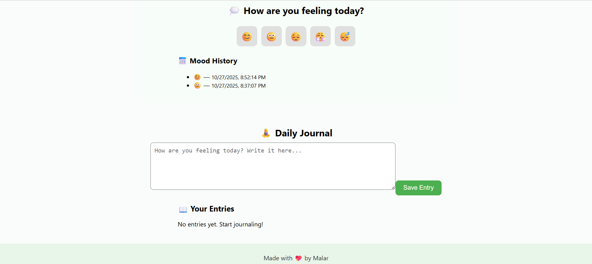

# 🌿 MindEase – Mental Health Tracker

MindEase is a simple React-based mental health tracker app that helps users log their mood, jot quick journal notes, and get friendly suggestions for self-care.

**🔗 Live Demo:** [https://malarvizhi7021.github.io/mindease/](https://malarvizhi7021.github.io/mindease/)

---

## ✨ Features
- 🧠 Mood Tracker — Select your daily mood
- 📝 Journal Section — Write your thoughts or reflections
- 🌈 Mood-based Suggestions — Encouraging ideas based on how you feel
- 💾 Local Storage Support — Keeps your data even after refreshing
- 📱 Responsive Design — Works on desktop and mobile

---

## 🧰 Tech Stack
- **Frontend:** React.js, JavaScript (ES6+), HTML, CSS  
- **Deployment:** GitHub Pages  

---

## ⚙️ Run Locally
```bash
git clone https://github.com/Malarvizhi7021/mindease.git
cd mindease
npm install
npm start
```

---

## 🚀 Deployment

To build and deploy your latest updates to GitHub Pages:

npm run build
npm run deploy

## 🚀 Future Enhancements

Here are some exciting features planned for future versions of MindEase:

🔐 User Authentication: Allow users to create accounts and save data securely

⏰ Daily Reminders: Notify users to log their mood at a chosen time

📊 Mood Analytics Dashboard: Show weekly/monthly mood trends with charts

💬 AI-Based Chat Support: Provide friendly responses and mental wellness tips

🪄 Dark Mode: Add light and dark theme toggle for better accessibility

🌍 Cloud Sync: Sync data across devices using Firebase or Supabase

## 📸 Screenshots

Here’s a preview of the MindEase app interface:

| Mood Tracker View | Journal View |
|-------------------|--------------|
|  |  |

## 👩‍💻 Author

Malar Vizhi K
B.Tech Artificial Intelligence and Data Science
## 🌐 GitHub Profile